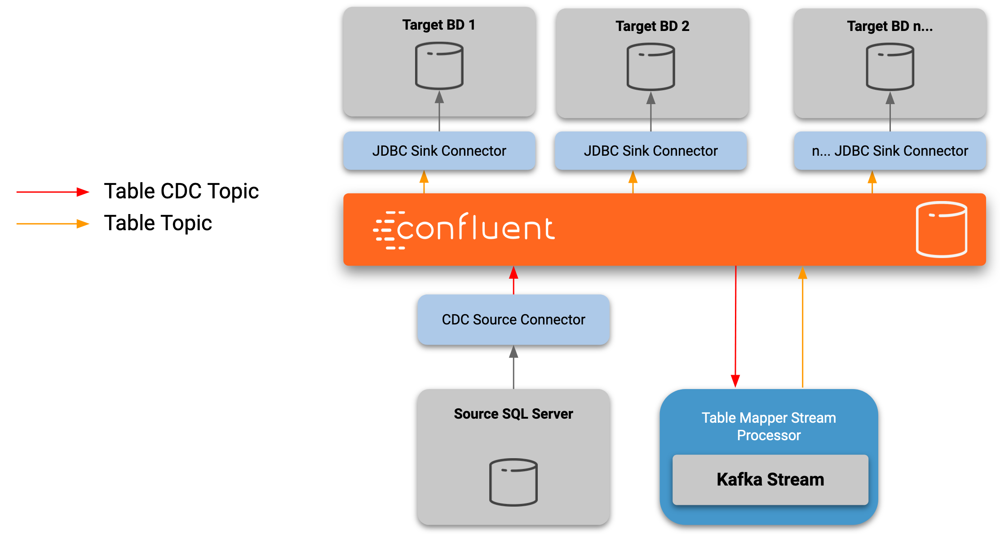

# 



# Pre requisites

* Docker
* Docker Compose
* confluent-hub CLI

# Steps

## Install the Debezium Connector for SQL Server

```
confluent-hub install --component-dir ./connectors  debezium/debezium-connector-sqlserver:0.10.0 
```

## Copy the mssql jdbc driver to a connect volume

```
cp connectors/debezium-debezium-connector-sqlserver/lib/mssql-jdbc-7.2.2.jre8.jar connectors/kafka-connect-jdbc.jar
```

## Start the platform

```
docker-compose up -d
```

## Create the database and configure Change Data Capture

```
./scripts/create-database.sh
```

## Start the Data Service for test data

```
./mvnw -f sqlserver-service/pom.xml clean package

java -jar sqlserver-service/target/sqlserver-service.jar
```

## Create the CDC Connector instance

```
curl -X POST http://localhost:8083/connectors \
  -H 'Content-Type: application/json' \
  -d @- << EOF
{
  "name": "cdc-connector",  
  "config": {
    "connector.class": "io.debezium.connector.sqlserver.SqlServerConnector", 
    "database.hostname": "sql-server", 
    "database.port": "1433", 
    "database.user": "sa", 
    "database.password": "Password!", 
    "database.dbname": "cdcdemo", 
    "database.server.name": "cdcdemo", 
    "database.history.kafka.bootstrap.servers": "kafka:9092", 
    "database.history.kafka.topic": "dbhistory.cdcdemo" 
  }
}
EOF
```

## Run the Table Replication Stream Processor

```
./mvnw -f cdc-replication-processor/pom.xml clean package

java -jar cdc-replication-processor/target/cdc-replication-processor.jar
```

## Create the Jdbc Sink Connector instance

```
curl -X POST http://localhost:8083/connectors \
  -H 'Content-Type: application/json' \
  -d @- << EOF
{
  "name": "replication-sink-connector",  
  "config": {
    "connector.class": "io.confluent.connect.jdbc.JdbcSinkConnector", 
    "tasks.max" : "1",
    "topics": "customer",
    "connection.url": "jdbc:sqlserver://replicated-db:1433;databaseName=cdcdemo;user=sa;password=Password!",
    "auto.create": "false",
    "insert.mode": "upsert",
    "pk.mode": "record_key",
    "pk.fields": "id"
  }
}
EOF
```

## Inspect the replicated database

```
docker exec -it sql-server-cdc-replicated-db bash -c '/opt/mssql-tools/bin/sqlcmd -U sa -P Password!'

use cdcdemo;
go
select count(1) from customer;
go
```